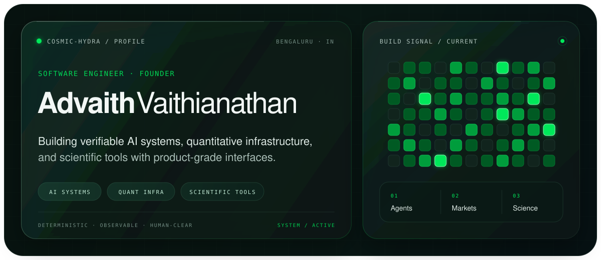

<picture>
  <source media="(max-width: 700px)" srcset="./assets/readme/hero-mobile.svg">
  
</picture>

 

[**LinkedIn**](https://www.linkedin.com/in/advaithvaithianathan) ·
[**ORCID**](https://orcid.org/0009-0000-2076-3011) ·
[**Email**](mailto:advaithv.av7@gmail.com)

## About

I'm Advaith, a Bengaluru-based engineer and founder working at the intersection of applied AI, quantitative systems, scientific computing, and product engineering. I build compact, observable systems that turn ambitious research into software people can actually use.

The projects here reflect a consistent thesis: that the most impactful systems in AI, science, and finance share the same architectural requirements -- determinism where it matters, rigorous evaluation, clean interfaces, and composable primitives over monolithic frameworks.

## Projects

### [zeroH](https://github.com/cosmic-hydra/zeroH)

Standard-library-first Python layer for grounded memory, retrieval, claim verification, citations, and abstention. Bring your own LLM (any API or local provider), and zeroH wraps it with a deterministic verify-reask-abstain loop that pushes hallucination rates toward zero. Durable SQLite-backed memory, sentence-aware chunking, confidence scoring, and citation emission -- all pure Python with zero heavyweight ML dependencies.

### [ZANE](https://github.com/cosmic-hydra/zane)

AI-native pharmaceutical operating system unifying target intelligence, molecule generation, free-energy physics, preclinical safety triage, compliance telemetry, and lab execution interfaces into a single orchestration-grade runtime. Funded by AMD and NVIDIA. Organized as a governed decision-gate pipeline where every molecular decision is generated, stress-tested, and cryptographically auditable.

### [vecomp](https://github.com/cosmic-hydra/vecomp)

A vector index built on TurboQuant, written in Rust with Python bindings. Designed to shrink the memory footprint of high-dimensional embeddings to roughly 2GB for practical-scale corpora. Exploration into practical quantization-aware retrieval for resource-constrained deployment.

### [Tetra Quant](https://github.com/cosmic-hydra/tetra-quant)

Quantitative trading research infrastructure built on the OpenBB platform. Pipeline-driven data ingestion, strategy backtesting, and signal analysis for systematic research.

### [Concepts](https://github.com/cosmic-hydra/Concepts)

AI-native note-taking application grounded in PNAS-backed retrieval. Structured around the idea that personal knowledge management benefits from the same grounding and verification primitives used in agentic systems.

### Hydra Fund

Software and research infrastructure for an early-stage AI-native investment and venture platform. Covers portfolio analytics, market data pipelines, and the research stack underpinning systematic decision-making.

## Toolbox

- **Languages:** Python, TypeScript, Swift, Rust, SQL, Go
- **Frameworks:** React, Next.js, FastAPI, OpenBB
- **Infrastructure:** PostgreSQL, SQLite, Docker, AWS
- **Domain:** LLM agents and evaluation, RAG systems, quantitative finance, molecular informatics, vector search, deterministic AI

## Operating principles

- **Determinism over heuristics** -- especially in evaluation, retrieval, and agent behavior. Stochasticity is a tool, not a default.
- **Composable over monolithic** -- small, standard-library-first primitives that compose well, inspired by the Unix philosophy applied to AI systems.
- **Evaluate honestly** -- benchmarks that measure what matters, citation-grounding verification, and abstention rates over inflated accuracy metrics.
- **Ship real things** -- applied research that produces software people can use, not papers that produce more papers.

## Connect

I'm interested in ambitious AI infrastructure, developer tooling, quantitative systems, and research software. [Email](mailto:advaithv.av7@gmail.com) or [LinkedIn](https://www.linkedin.com/in/advaithvaithianathan).
