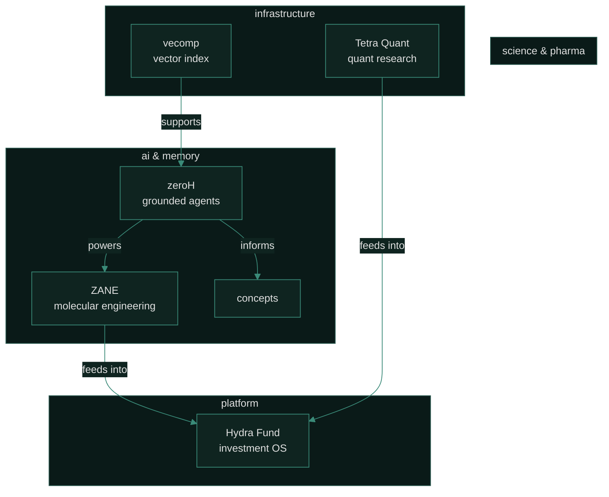

<div align="center">

<picture>
  <source media="(max-width: 700px)" srcset="./assets/readme/hero-mobile.svg">
  
</picture>

<br>

<a href="https://www.linkedin.com/in/advaithvaithianathan">
  
</a>
<a href="https://orcid.org/0009-0000-2076-3011">
  
</a>
<a href="mailto:advaithv.av7@gmail.com">
  
</a>
<a href="https://github.com/cosmic-hydra">
  
</a>

</div>

<br>

```text
╔══════════════════════════════════════════════════════════════════════╗
║                                                                      ║
║   ██████╗ ██████╗ ███████╗███╗   ███╗██╗ ██████╗    ██╗  ██╗   ██╗   ║
║  ██╔════╝██╔═══██╗██╔════╝████╗ ████║██║██╔════╝    ██║  ╚██╗ ██╔╝   ║
║  ██║     ██║   ██║███████╗██╔████╔██║██║██║         ███████╗╚████╔╝    ║
║  ██║     ██║   ██║╚════██║██║╚██╔╝██║██║██║         ██╔══██║ ╚██╔╝     ║
║  ╚██████╗╚██████╔╝███████║██║ ╚═╝ ██║██║╚██████╗    ██║  ██║  ██║      ║
║   ╚═════╝ ╚═════╝ ╚══════╝╚═╝     ╚═╝╚═╝ ╚═════╝    ╚═╝  ╚═╝  ╚═╝      ║
║                                                                      ║
║  software engineer · founder · bengaluru                             ║
║  applied AI · quantitative systems · scientific computing            ║
║                                                                      ║
╚══════════════════════════════════════════════════════════════════════╝
```

```text
  about
  ─────
  I build at the intersection of applied AI, quantitative systems,
  scientific computing, and product engineering.

  The projects here share a consistent thesis: that the most impactful
  systems in AI, science, and finance benefit from determinism where it
  matters, rigorous evaluation, clean interfaces, and composable
  primitives over monolithic frameworks.
```

<br>

```text
  ecosystem
  ─────────
```



<br>

```text
  projects
  ────────
```

<br>

<!-- zeroH -->
<table>
  <tr>
    <td width="200" align="center" valign="top">
      <br>
      <a href="https://github.com/cosmic-hydra/zeroH">
        
      </a>
      <br><br>
      <sub><em>Zero Hallucination for AI agents</em></sub>
      <br><br>
      
      <br>
      
    </td>
    <td valign="top">
      <br>
      A standard-library-first Python layer for grounded memory, retrieval, claim verification, citations, and abstention. Bring your own LLM — any API or local provider — and zeroH wraps it with a deterministic <strong>verify-reask-abstain</strong> loop that pushes hallucination rates toward zero.
      <br><br>
      Durable SQLite-backed memory, sentence-aware chunking, confidence scoring, and citation emission — all pure Python with zero heavyweight ML dependencies.
      <br><br>
      <details>
        <summary>architecture</summary>
        <br>
        <pre>
query ──► retrieve ──► augment ──► [LLM] ──► verify ──► answer
                          ▲                    │
                          └──── re-ask ─────────┘
                               or abstain
        </pre>
      </details>
    </td>
  </tr>
</table>

<br>

<!-- ZANE -->
<table>
  <tr>
    <td width="200" align="center" valign="top">
      <br>
      <a href="https://github.com/cosmic-hydra/zane">
        
      </a>
      <br><br>
      <sub><em>Pharma OS for Autonomous Molecular Engineering</em></sub>
      <br><br>
      
      <br>
      
      
    </td>
    <td valign="top">
      <br>
      AI-native pharmaceutical operating system unifying target intelligence, molecule generation, free-energy physics, preclinical safety triage, compliance telemetry, and lab execution interfaces into a single orchestration-grade runtime.
      <br><br>
      Funded by <strong>AMD</strong> and <strong>NVIDIA</strong>. Every molecular decision is generated, stress-tested, and cryptographically auditable through governed decision gates.
    </td>
  </tr>
</table>

<br>

<!-- vecomp -->
<table>
  <tr>
    <td width="200" align="center" valign="top">
      <br>
      <a href="https://github.com/cosmic-hydra/vecomp">
        
      </a>
      <br><br>
      <sub><em>Vector compression via TurboQuant</em></sub>
      <br><br>
      
      
    </td>
    <td valign="top">
      <br>
      A vector index written in <strong>Rust</strong> with Python bindings that shrinks high-dimensional embedding footprints to roughly <strong>2GB</strong> for practical-scale corpora. Exploration into quantization-aware retrieval for resource-constrained deployment.
    </td>
  </tr>
</table>

<br>

<!-- Tetra Quant -->
<table>
  <tr>
    <td width="200" align="center" valign="top">
      <br>
      <a href="https://github.com/cosmic-hydra/tetra-quant">
        
      </a>
      <br><br>
      <sub><em>Quantitative trading research infrastructure</em></sub>
      <br><br>
      
    </td>
    <td valign="top">
      <br>
      Pipeline-driven data ingestion, strategy backtesting, and signal analysis built on the <strong>OpenBB</strong> platform for systematic research.
    </td>
  </tr>
</table>

<br>

<!-- Concepts -->
<table>
  <tr>
    <td width="200" align="center" valign="top">
      <br>
      <a href="https://github.com/cosmic-hydra/Concepts">
        
      </a>
      <br><br>
      <sub><em>AI-native note-taking with PNAS-backed retrieval</em></sub>
      <br><br>
      
    </td>
    <td valign="top">
      <br>
      Personal knowledge management that applies grounding and verification primitives from agentic systems to daily notes and ideas.
    </td>
  </tr>
</table>

<br>

<!-- Hydra Fund -->
<table>
  <tr>
    <td width="200" align="center" valign="top">
      <br>
      
      <br><br>
      <sub><em>AI-native investment platform</em></sub>
    </td>
    <td valign="top">
      <br>
      Software and research infrastructure for an AI-native investment and venture platform. Portfolio analytics, market data pipelines, and the research stack underpinning systematic decision-making.
    </td>
  </tr>
</table>

<br>

```text
  toolbox
  ───────
```

<br>

<div align="center">

<a href="#">
  
</a>
<a href="#">
  
</a>
<a href="#">
  
</a>
<a href="#">
  
</a>
<a href="#">
  
</a>

<br><br>

<a href="#">
  
</a>
<a href="#">
  
</a>
<a href="#">
  
</a>
<a href="#">
  
</a>

<br><br>

<a href="#">
  
</a>
<a href="#">
  
</a>
<a href="#">
  
</a>
<a href="#">
  
</a>

</div>

<br>

```text
  operating principles
  ────────────────────
```

<br>

```text
  ┌─────────────────────────────────────────────────────────────────┐
  │  determinism over heuristics                                    │
  │  stochasticity is a tool, not a default                         │
  │  ── especially in evaluation, retrieval, and agent behavior     │
  ├─────────────────────────────────────────────────────────────────┤
  │  composable over monolithic                                     │
  │  small, standard-library-first primitives                       │
  │  ── inspired by the Unix philosphy applied to AI systems        │
  ├─────────────────────────────────────────────────────────────────┤
  │  evaluate honestly                                              │
  │  benchmarks that measure what matters                           │
  │  ── citation-grounding verification, abstention rates, gaps     │
  ├─────────────────────────────────────────────────────────────────┤
  │  ship real things                                               │
  │  applied research that produces software people can use         │
  │  ── not papers that produce more papers                         │
  └─────────────────────────────────────────────────────────────────┘
```

<br>

```text
  activity
  ────────
```

<br>

<div align="center">

<a href="https://github.com/cosmic-hydra">
  
</a>
<a href="https://github.com/cosmic-hydra">
  
</a>

</div>

<br>

```text
  connect
  ───────
```

<br>

<div align="center">

<a href="https://www.linkedin.com/in/advaithvaithianathan">
  
</a>
<a href="mailto:advaithv.av7@gmail.com">
  
</a>
<a href="https://github.com/cosmic-hydra">
  
</a>

<br><br>

<sub>last updated 2026 · cosmic-hydra</sub>

</div>
