<picture>
  
</picture>

<picture>
  
</picture>

<picture>
  
</picture>

<picture>
  
</picture>

<picture>
  <source media="(prefers-color-scheme: dark)" srcset="https://github-readme-activity-graph.vercel.app/graph?username=cosmic-hydra&bg_color=00000000&color=f5f5f7&line=2997ff&point=2997ff&area=true&area_color=2997ff&hide_border=true&radius=4&custom_title=CONTRIBUTION%20SIGNAL">
  
</picture>

<picture>
  
</picture>
